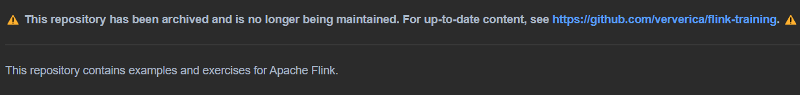

В лабораторной возникли проблемы с https://github.com/ververica/flink-training-exercises 

Возникала проблема с зависимостями  org.apache.flink:flink-table_2.11:jar:1.10.0 was not found in https://repo.maven.apache.org/maven2 during a previous attempt. This failure was cached in the local repository and resolution is not reattempted until the update interval of central has elapsed or updates are forced

не понял как ее починить поэтому выполнил работу 

В ней не было ExpiringStateExercise, вместо него сделал LongRidesExercise (ну и код для ExpiringStateExercise но хз работает ли он)
